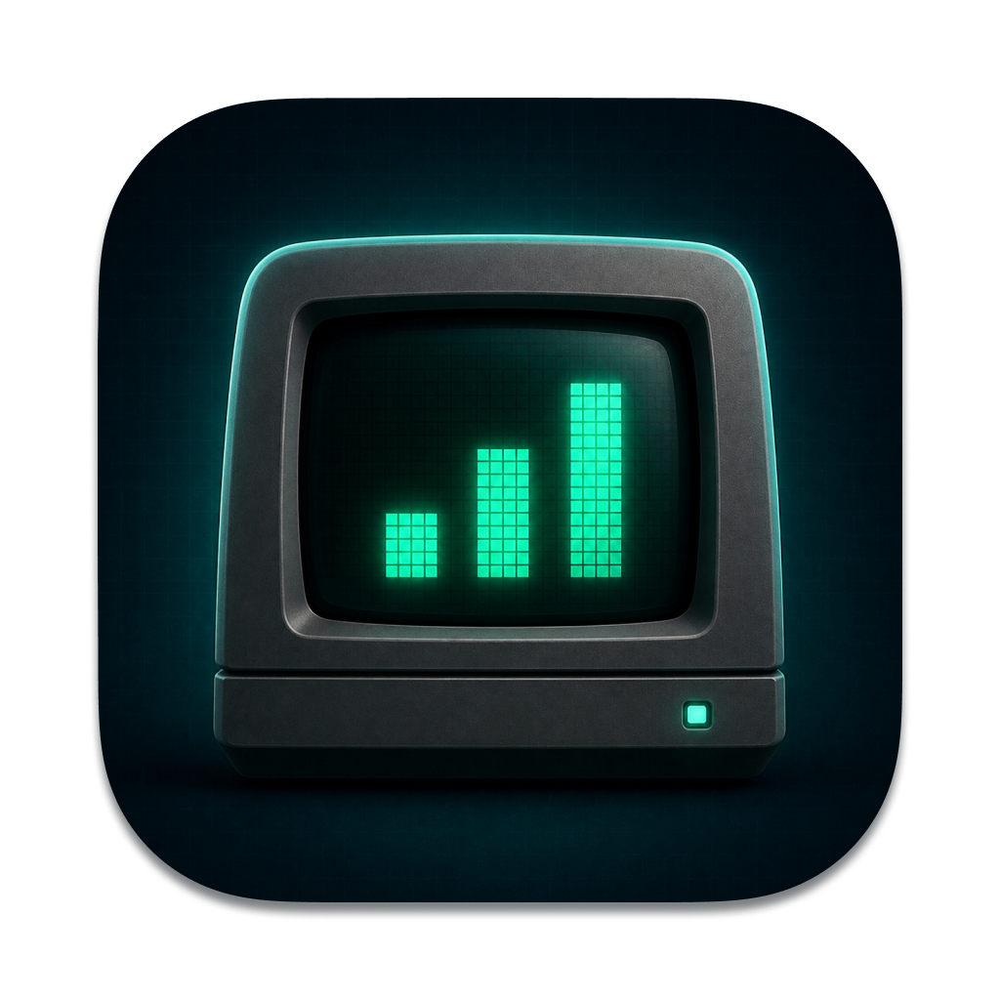

# Analytics Bar

<p align="center">
  
</p>

**A native macOS menu bar dashboard for Google Analytics 4.** Follow live and daily performance across multiple selected properties without keeping Analytics open in a browser.

<p align="center">
  <a href="https://github.com/burakereno/analytics-bar/releases/latest/download/AnalyticsBar.dmg">
    
  </a>
  &nbsp;
  <a href="https://github.com/burakereno/analytics-bar/releases/latest">
    
  </a>
</p>

<p align="center">
  <sub>macOS 14.0+ · Google Analytics read-only access · Developer ID signed and notarized</sub>
</p>

## Features

- **Multi-property dashboard** — monitor multiple GA4 properties at the same time
- **Weekly overview** — sessions over the last seven complete property-local days, compared with the preceding week, with a per-property summary
- **Connection diagnostics in Settings** — last successful fetch and attempt per report, explicit reconnect and stale-data states, and account and site reloading
- **Unavailable sites stay visible** — saved selections remain listed until explicitly removed, without silently dropping sites or reporting missing data as zero
- **Independent reports** — a failed realtime report does not discard successful daily data, and vice versa
- **Live activity** — property-summed active users, views, events, and key events from the last 30 minutes
- **Today at a glance** — users, sessions, views, key events, honest currency-aware revenue, and a separately queried same-hour comparison with yesterday
- **Seven-day trends** — switch between users, sessions, and views; hover any bar for its date and value
- **Property detail** — keep every selected property visible with its own live and daily metrics
- **Top pages and sources** — inspect rankings per property instead of merging unrelated domains
- **Configurable menu bar** — defaults to weekly sessions; choose live users, users today, sessions today, views today, or icon only. Unavailable data shows a dash and warning instead of a misleading zero
- **Native settings** — launch at login, Dock visibility, refresh cadence, revenue visibility, and automatic property selection changes
- **One-click in-app updates** — validates the release manifest, SHA-256, bundle identifier, Team ID, Developer ID signature, and Gatekeeper assessment
- **Read-only by design** — requests only the Google Analytics read-only scope and stores OAuth tokens in macOS Keychain

Today shows the latest daily figures available from Google, including the current hour. Daily figures can be delayed by Google processing; a successful fetch is not a guarantee that all recent events have been processed.

Combined user values are property sums. The same person may be counted by more than one property.

## Installation

### Download DMG

1. Go to the [latest release](../../releases/latest)
2. Download **`AnalyticsBar.dmg`**
3. Open the DMG and drag **Analytics Bar.app** to **Applications**
4. Launch Analytics Bar; it appears in the macOS menu bar

The release workflow signs the app and DMG with Developer ID, notarizes both with Apple, staples the notarization tickets, and publishes a matching update manifest.

## Build from Source

### Requirements

- macOS 14.0+
- Xcode 16.0+
- A Google Cloud project with **Google Analytics Admin API** and **Google Analytics Data API** enabled
- A Google OAuth 2.0 **Desktop app** client with access to your Google Analytics account

### Steps

```bash
git clone https://github.com/burakereno/analytics-bar.git
cd analytics-bar

./script/configure_oauth.sh
./scripts/build-app.sh
open ".build/Analytics Bar.app"
```

`configure_oauth.sh` stores the client configuration in the ignored, permission-restricted `.env.local` file. OAuth access and refresh tokens are stored separately in macOS Keychain.

## Privacy

Analytics Bar talks directly to Google Analytics and GitHub Releases. It does not use an app-owned server and does not upload Analytics data, OAuth tokens, or signing credentials. See [Privacy & Data Handling](docs/privacy.md) for details.

## Tech Stack

- **SwiftUI** — dashboard, settings, charts, and onboarding
- **AppKit** — menu bar status item, popover lifecycle, and dynamic sizing
- **Swift Package Manager** — build and test system
- **Google Analytics Admin & Data APIs** — property discovery, realtime, and daily reports
- **Security / Keychain** — local OAuth token storage
- **GitHub Actions** — Developer ID signing, Apple notarization, DMG packaging, and update manifests
